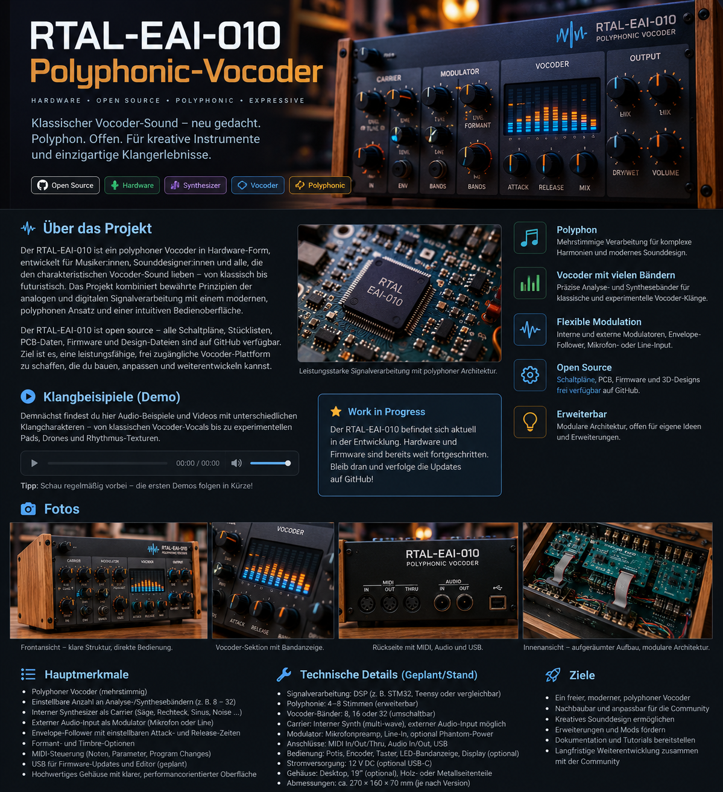
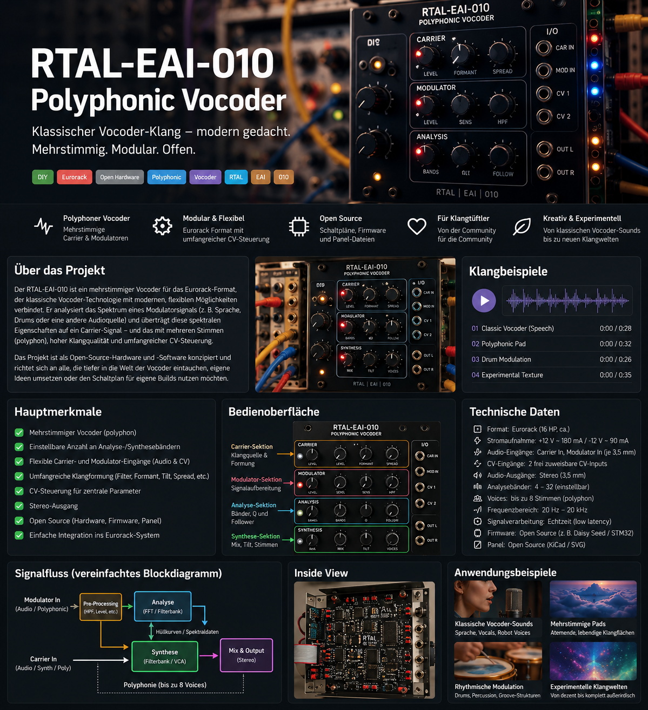
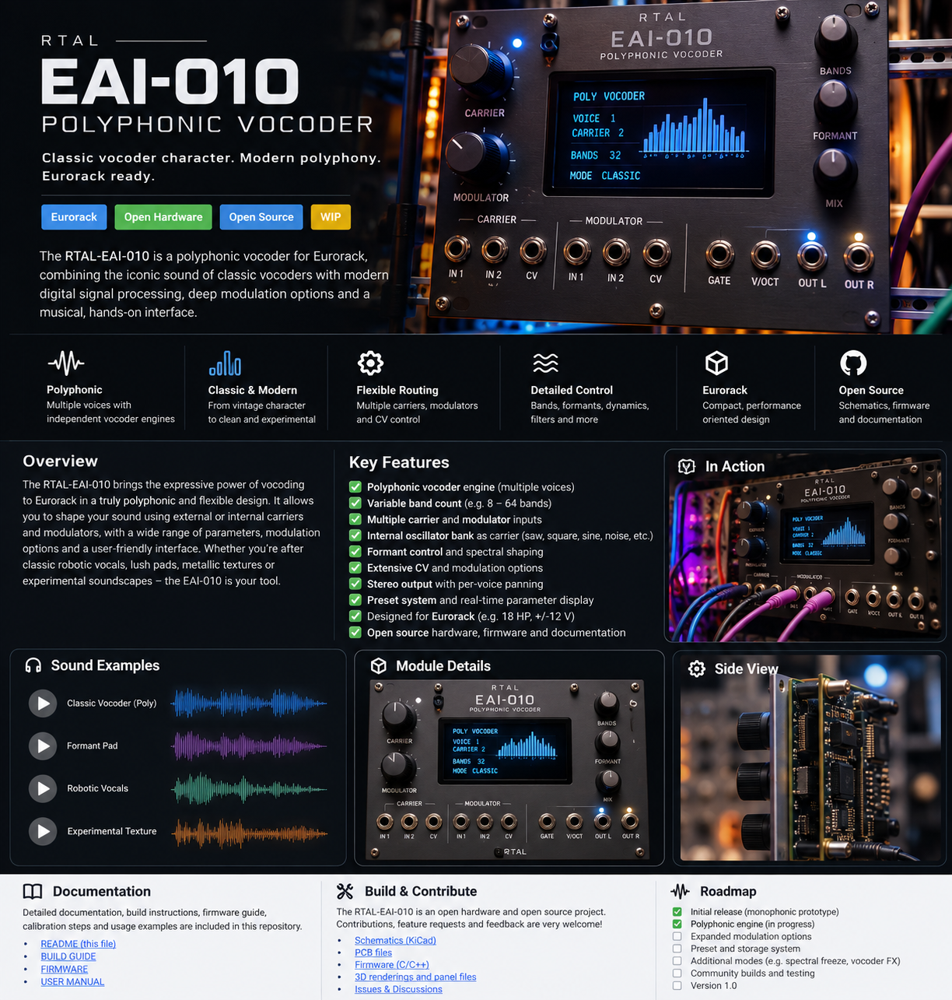

<div align="center">

# RTAL-EAI-010 Polyphonic Vocoder

### ESP32-S3 real-time polyphonic vocoder with 20-band analysis, MIDI carrier engine and deep stereo ensemble

**Development Preview - September 2026**


**RealTimeAudioLab / RTAL**

> A dedicated hardware vocoder built around the ESP32-S3: speech analysis, a polyphonic MIDI-controlled carrier, natural consonant reconstruction, real-time spectrum visualization and a wide three-tap ensemble - all running inside a strict 4 ms audio block budget.

</div>

---

<p align="center">
  
</p>

<p align="center"><em>Concept visualization for the GitHub teaser. The current development hardware is based on the RTAL Phoenix C036 ESP32-S3 platform and does not yet use the enclosure shown above.</em></p>

---

## Project status

RTAL-EAI-010 is currently under active development.

The project has already moved well beyond a first proof of concept. The present development line is built around the sound and speech intelligibility of the proven **V001W vocoder core**, while the current **V002C SUPER ENSEMBLE** branch adds a substantially wider and more animated post-vocoder stereo image.

The focus is not simply to make speech recognizable. The target is a playable hardware instrument with a strong musical identity: clear enough for intelligible robotic speech, but also capable of chords, pads, drones and synthetic vocal textures when the internal carrier is played polyphonically from MIDI.

This repository is being prepared as a development teaser. Firmware and hardware details may still change before the first public release.

---

# What is RTAL-EAI-010?

A conventional vocoder divides a **modulator** signal - normally speech - into frequency bands, measures the energy in those bands and transfers the resulting spectral envelopes to a **carrier** signal.

RTAL-EAI-010 follows this classic principle, but implements it as a purpose-built real-time DSP instrument on the **ESP32-S3**.

The current architecture combines:

- a 20-band analysis/synthesis filterbank
- a MIDI-playable polyphonic internal carrier
- adaptive speech-oriented carrier behavior
- dedicated consonant and high-frequency reconstruction
- selectable MEMS or PCM1808 audio input
- real-time envelope and spectrum monitoring
- a CPU-efficient FAST biquad DSP core
- a three-tap deep ensemble after the vocoder
- real-time diagnostics for DSP load, peaks and audio errors

The result is intended to sit between the character of classic hardware vocoders and the flexibility of a modern embedded digital instrument.

---

# Current audio architecture

```text
                         MODULATOR / SPEECH
                                |
                    +-----------+-----------+
                    |                       |
              I2S MEMS MIC              PCM1808 ADC
               GPIO8 input              external input
                    |                       |
                    +-----------+-----------+
                                |
                         Input Gain / HPF
                                |
                                v
                    20-BAND ANALYSIS BANK
                                |
                         Envelope Followers
                                |
              +-----------------+-----------------+
              |                                   |
              |                          HF / Consonant Analysis
              |                                   |
              v                                   v
       20 spectral envelopes               Natural Consonants
              |                                   |
              |                                   |
              |      POLYPHONIC MIDI CARRIER      |
              |                  |                |
              |           Carrier A / B           |
              |                  |                |
              +------------------+----------------+
                                 |
                                 v
                     20-BAND SYNTHESIS BANK
                                 |
                      Adaptive Speech Shaping
                                 |
                         Unvoiced / HF Path
                                 |
                                 v
                       VOCODER CORE OUTPUT
                                 |
                                 v
                    V002C SUPER ENSEMBLE
                      3 modulated delay taps
                         light feedback
                                 |
                                 v
                           FINAL MIX
                                 |
                                 v
                          I2S AUDIO OUT
```

---

# The vocoder core

## 20-band filterbank

The current reference implementation uses **20 analysis bands** and corresponding synthesis bands. This is a deliberate middle ground.

Too few bands produce the unmistakable old-school robotic character, but reduce speech intelligibility. A very large filterbank increases CPU load and can make the system harder to tune within a fixed embedded real-time budget. The current 20-band design has proven to be a useful balance for the ESP32-S3 platform.

Each analysis band extracts the energy of a region of the speech spectrum. The resulting envelope is then used to control the corresponding band in the carrier path.

The filterbank is built around the CPU-efficient **FAST biquad** implementation introduced earlier in the development line. The real-time path is designed to avoid unnecessarily expensive per-sample math.

## Envelope behavior

A vocoder does not only need the correct frequency bands; the dynamics of those bands are equally important.

The envelope followers are tuned so that:

- vowels remain stable and full
- syllable transitions stay fast enough for articulation
- consonants do not smear excessively
- short speech events remain recognizable
- the output does not collapse into an over-smoothed pad

This part of the DSP has been repeatedly refined through the V001 development series.

---

# Natural Consonants

One of the most important goals of the project is improved intelligibility without destroying the synthetic vocoder character.

Pure band-envelope vocoding often handles vowels well, while consonants such as **S**, **F**, **T**, **K** and other noise-like components can become weak or disappear completely. Earlier development versions also showed that simply adding more noise can create an unpleasant trailing hiss.

The current implementation therefore uses a dedicated **Natural Consonants / Unvoiced** path.

It analyzes high-frequency and unvoiced speech energy separately and adds it back in a controlled way. The reference V001W setup uses a restrained unvoiced contribution rather than a permanently strong noise generator.

Current reference direction:

- natural high-frequency reconstruction
- fast release for consonant energy
- no long noise tail after speech
- approximately **8 percent UNVOICED** in the preferred V001W reference setup
- **DIRECT = 0 percent** in the preferred reference setup

The goal is to make speech clearer while preserving the impression that the voice is being synthesized rather than simply mixed with the dry microphone signal.

---

# Polyphonic MIDI carrier

RTAL-EAI-010 is designed as a **polyphonic musical instrument**, not merely as a speech effect.

MIDI notes control the internal carrier pitches. This makes it possible to speak into the modulator input while playing:

- single-note robotic leads
- chords
- sustained pads
- moving harmonic clusters
- sequenced carrier patterns
- arpeggiated vocal textures

The current firmware contains selectable **Carrier A / Carrier B** behavior. Carrier B is presently the preferred reference in the V001W/V002C development line.

The exact public carrier feature set and final voice limit will be frozen later in development, after the remaining sound-quality and CPU-headroom work has been completed.

---

# Adaptive Speech Carrier

A static bright waveform is not automatically an ideal carrier for every speech sound.

V001W introduced a **block-rate adaptive speech carrier** approach. Instead of treating the carrier as an entirely independent oscillator bank, the system can use information derived from the modulator to keep the spectral balance more useful for speech reproduction.

This is intentionally done at control/block rate where possible, preserving CPU budget for the actual filterbank processing.

The purpose is not to make the result natural or transparent. The purpose is to give the 20 synthesis bands a carrier spectrum that remains useful across different vowels and consonants.

---

# V002C SUPER ENSEMBLE

The preferred vocoder core itself is intentionally kept recognizable and articulate. Width and animation are added **after** the core.

The current V002C branch uses a dedicated three-tap ensemble:

| Tap | Delay range | LFO rate |
|---|---:|---:|
| Tap 1 | approx. 3-16 ms | approx. 0.13 Hz |
| Tap 2 | approx. 8-25 ms | approx. 0.34 Hz |
| Tap 3 | approx. 15-31 ms | approx. 0.56 Hz |

Additional characteristics:

- three independently moving delay taps
- deliberately slow, non-identical modulation rates
- deep stereo spreading
- light feedback, internally up to roughly **24 percent**
- ensemble amount continuously adjustable
- the dry vocoder definition is retained underneath the widening effect
- Natural Consonants and unvoiced information remain outside the heavily modulated path so intelligibility is not unnecessarily blurred

The ensemble was developed in several steps from V001Y through V002A and V002C. The current setting is intentionally stronger than a conventional subtle chorus. It is meant to become part of the signature sound of the instrument.

---

<p align="center">
  
</p>

<p align="center"><em>Development concept visualization. Front-panel layout, connectors and enclosure are not final hardware specifications.</em></p>

---

# Audio engine

| Parameter | Current development value |
|---|---|
| MCU | ESP32-S3 |
| Development platform | RTAL Phoenix C036 base |
| Internal sample rate | **32 kHz** |
| Audio block size | **128 frames** |
| Block duration | **4.0 ms** |
| Main vocoder filterbank | **20 bands** |
| Audio task | Core 1, high priority |
| Current task priority | P24 in the development build |
| Default modulator input | I2S MEMS microphone |
| Alternate modulator input | PCM1808 ADC |
| Default MEMS data pin | GPIO8 |
| Default MEMS word | word 0, L/R select to GND |
| Preferred development input gain | approximately +12 dB |
| Input HPF | approximately 80 Hz reference setting |
| Carrier | internal, MIDI controlled, polyphonic |
| Post effect | V002C three-tap deep ensemble |

These values describe the current development platform and are not yet a promise of the final release specification.

---

# Real-time performance

At 32 kHz with 128-frame blocks, the complete audio callback has approximately **4 ms** available before the next block is due.

Current development logs show substantial remaining margin:

- V001W core typically around **2.26-2.32 ms** DSP time in representative runs
- observed V001W peak around **2.45 ms** in the reference tests
- later ensemble development builds remain around the mid-2 ms range, with observed peaks still below roughly **2.6 ms** in the tested runs
- audio error counter remained at **0** in the captured reference sessions

This margin is important. RTAL firmware development deliberately avoids treating "it usually runs" as sufficient for audio DSP. The target is a stable real-time system that survives speech peaks, MIDI activity, display updates and continuous operation without underruns.

---

# Input options

## I2S MEMS microphone

The current default development input is a digital MEMS microphone connected directly to the ESP32-S3 I2S input.

Reference configuration:

```text
DATA       GPIO8
L/R SELECT GND
I2S word   0
Gain       approx. +12 dB
HPF        approx. 80 Hz
```

This configuration is especially convenient during vocoder development because it gives a compact, self-contained speech input.

## PCM1808

The firmware can also switch to the **PCM1808** audio ADC used elsewhere in the RTAL hardware ecosystem.

This allows the vocoder to process higher-quality external sources such as:

- dynamic or condenser microphone preamps
- synthesizers
- drum machines
- prerecorded speech
- field recordings
- other line-level sources

The intention is to keep the vocoder useful both as a dedicated vocal instrument and as an experimental spectral processor.

---

# Display and diagnostics

The project includes a real-time visual representation of the analyzed speech spectrum.

The display is not intended to be decorative only. During development it also helps verify:

- which bands dominate at a given moment
- envelope behavior
- high-frequency consonant activity
- input level
- DSP timing
- carrier mode
- error state

Representative diagnostic values used by the firmware include:

```text
inPk   input peak
envPk  strongest current envelope
band   dominant analysis band
HFenv  high-frequency envelope activity
CON    consonant contribution
CAR    selected carrier profile
blocks processed audio blocks
dsp    current / peak DSP time
midi   MIDI activity counter
err    audio error counter
```

The diagnostics are especially useful because changes in speech quality can be correlated directly with DSP load and input behavior rather than evaluated by ear alone.

---

<p align="center">
  
</p>

<p align="center"><em>Concept image illustrating the intended idea of a hardware vocoder with direct spectral feedback. It is not a photograph of the current Phoenix C036 prototype.</em></p>

---

# Development history

The current sound is the result of a sequence of focused iterations rather than one large rewrite.

| Version | Development focus |
|---|---|
| V001A | first working real-time vocoder architecture |
| V001B | fuller and clearer vocal character |
| V001C | reduction of excessive noise tail |
| V001D | noise-off / fast high-frequency release strategy |
| V001F | formant clarity and more natural consonants |
| V001G | increased formant resolution |
| V001H | vocal clarity / carrier flattening work |
| V001T | FAST biquad real-time core |
| **V001W** | preferred vocoder core: 20 bands, polyphonic Carrier B, Natural Consonants, adaptive speech carrier |
| V001X | experimental branch, not retained as the preferred sound |
| V001Y | first dedicated ensemble development |
| V002A | three-tap deep ensemble plus light feedback |
| **V002C** | current SUPER ENSEMBLE reference, stronger width and movement while preserving the V001W core |

The development policy is intentionally conservative: when a new DSP idea sounds worse than the reference version, the reference is retained instead of forcing the new branch forward.

---

# Why 32 kHz?

RTAL-EAI-010 currently runs at **32 kHz** by design.

For this instrument, that choice provides a useful balance between:

- enough bandwidth for speech intelligibility and consonants
- predictable 4 ms blocks at 128 frames
- significantly more DSP headroom for a multi-band filterbank
- room for polyphonic carrier generation
- room for post-vocoder effects
- stable real-time behavior on a single ESP32-S3

The design priority is not the largest sample-rate number. It is the best complete instrument that can run reliably within the available real-time budget.

---

# Design goals

## 1. Recognizable speech

The vocoder should remain understandable in real musical use, not only with slow test words.

## 2. Strong electronic character

This is not intended to emulate transparent speech transmission. The sound should remain clearly synthetic and musical.

## 3. Polyphonic playability

The carrier should feel like a synthesizer under MIDI control, enabling chords and expressive harmonic movement.

## 4. Embedded real-time stability

Every feature has to fit into the actual ESP32-S3 block deadline with margin.

## 5. Efficient DSP

Expensive operations are avoided in the render loop where practical. Filter and modulation code is designed for deterministic embedded use.

## 6. Visual feedback

The spectrum display should make the vocoder behavior visible while also serving as a useful development instrument.

## 7. Character effects after the core

Width, ensemble and later ambience should enhance the vocoder without masking consonants or compromising the core speech engine.

---

# Planned next steps

The current priorities are:

- freeze the V002C SUPER ENSEMBLE sound as a stable reference
- complete tuning across different voices, microphones and source levels
- continue long-duration underrun and stability tests
- refine the final UI and hardware controls
- add preset storage
- define the final public MIDI implementation
- create proper hardware photos and audio demonstrations
- evaluate a restrained dark reverb after the ensemble without weakening articulation
- prepare the first public firmware preview

A possible reverb stage is being investigated as a later branch. It is **not** part of the frozen V002C reference and will only be retained if the vocoder remains clear and the real-time margin stays healthy.

---

# Sound demos

Audio examples will be added as the development reference becomes stable enough to make comparisons meaningful.

Planned demo material:

1. dry V001W vocoder core
2. V002C ensemble at several depths
3. single-note robotic speech
4. polyphonic chord performance
5. sustained pads and choir-like textures
6. external PCM1808 source processing
7. speech intelligibility comparison between development generations

GitHub supports attached MP4 files particularly well for demonstrations, so the final repository will include short videos showing both the sound and the real-time spectrum display.

---

# Hardware photos

The three images currently included in this teaser are **concept visualizations**, not photographs of the final instrument.

The real development system currently uses the **RTAL Phoenix C036 ESP32-S3 hardware base**. Actual prototype photographs will replace or complement these visualizations before the first formal release.

Recommended future repository layout:

```text
images/
  RTAL_EAI_010_Prototype_Front.jpg
  RTAL_EAI_010_Phoenix_C036.jpg
  RTAL_EAI_010_MEMS_Input.jpg
  RTAL_EAI_010_Spectrum_Display.jpg
  RTAL_EAI_010_Inside.jpg
```

---

# Repository structure - planned

```text
RTAL-EAI-010-Polyphonic-Vocoder/
|
+-- README.md
+-- firmware/
|   +-- RTAL_EAI_010_Vocoder/
|
+-- docs/
|   +-- architecture.md
|   +-- dsp-notes.md
|   +-- hardware.md
|   +-- midi.md
|
+-- images/
|   +-- rtal_eai_010_hero_concept.png
|   +-- rtal_eai_010_system_concept.png
|   +-- rtal_eai_010_frontpanel_concept.png
|
+-- media/
    +-- demos/
```

---

# Development philosophy

RTAL projects are built by repeatedly testing real hardware rather than designing only from theoretical CPU estimates.

For RTAL-EAI-010 this means:

- listen to every major DSP revision
- compare new versions against a known-good sound reference
- measure actual block execution time
- keep peak timing visible
- watch error counters during real MIDI and speech use
- preserve versions that sound better, even when a newer algorithm is technically more sophisticated
- add post effects only when the vocoder itself remains intelligible

This approach is the reason **V001W remains the core reference** while the newer V002C work is concentrated mainly on the post-vocoder ensemble.

---

# Current reference summary

```text
Project:        RTAL-EAI-010 Polyphonic Vocoder
Platform:       ESP32-S3 / Phoenix C036 development base
Audio:          32 kHz / 128 frames / 4 ms blocks
Filterbank:     20 analysis + 20 synthesis bands
Carrier:        polyphonic MIDI carrier, Carrier B preferred
Speech path:    Natural Consonants + controlled unvoiced reconstruction
Core reference: V001W
Current branch: V002C SUPER ENSEMBLE
Ensemble:       3 modulated taps + light feedback
Input:          I2S MEMS or PCM1808
Display:        spectrum / band activity / diagnostics
Status:         active development
```

---

# About RealTimeAudioLab

**RealTimeAudioLab (RTAL)** is a collection of hardware and DSP projects focused on turning affordable embedded processors into complete real-time musical instruments.

The emphasis is on practical hardware, deterministic audio processing, direct musical control and iterative listening tests rather than desktop-only prototypes.

RTAL-EAI-010 extends that approach into speech synthesis and spectral processing: a polyphonic vocoder designed as an instrument from the beginning.

---

<div align="center">

## RTAL-EAI-010 Polyphonic Vocoder

**20 bands. Polyphonic MIDI carrier. Natural consonants. Deep ensemble. ESP32-S3.**

**Work in progress - more soon.**

RealTimeAudioLab / 2026

</div>
